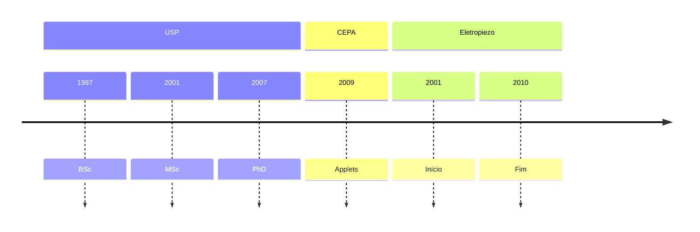

# Outros currículos

- [Lattes](http://lattes.cnpq.br/6688104156301227)
- [LinkedIn](https://linkedin/in/irpagnossin)

# Experiência profissional


Líder de Engenharia e Ciência de dados.


















Professor e professor-autor do curso de pós-graduação _Latu Sensu_ em Design Instrucional.



Líder técnico de desenvolvimento de softwares educacionais voltados para a Educação a Distância e lousas eletrônicas.






Desenvolvedor de URA.



Caixa Econômica Federal



Pesquisador bolsista de iniciação científica na formação de plasma no Tokamak TCA-BR do IF/USP.





# Competências técnicas
Citar DS-BOK; desenvolvimento

# Competências socio-emocionais
Sou dedicado e comprometido com a excelência do meu trabalho; proativo e orientado aos resultados e prazos. Tenho ótimas habilidades de comunicação, transmissão de conhecimento e inteligência emocional; e estou sempre ávido para aprender. Sou empático com clientes e colegas e porto-me sempre de maneira profissional, ética, justa, racional e analítica. Sou autodidata e trabalho bem com equipes, inclusive multidisciplinares, em posição de liderança ou não.

Minha personalidade é categorizada como [INTJ](https://www.16personalities.com/intj-personality) conforme o modelo [MBTI](https://www.16personalities.com/personality-types). Já conforme o modelo [BigFive], eu mostro traços equilibrados de consciosidade, etc (RESULTADO), conforme o instrumento de avaliação canadense e o modelo adaptado ao Português brasileiro, o IGFP-5.

# Idiomas

- Inglês avançado (89% TOEFL em 2006)
- Português nativo
- Francês básico (o suficiente para sobreviver na França em 2007. Agora já está meio enferrujado)

# Certificações

- Associate Cloud Engineering (**WIP**)

# Formação acadêmica
- Especialista em Computação Aplicada à Educação, [ICMC/USP](https://especializacao.icmc.usp.br/), 2021.
- Doutorado em Física (PhD), [IF/USP](https://portal.if.usp.br/ifusp/), 2007.
- Mestrado em Física (MSc), [IF/USP](https://portal.if.usp.br/ifusp/), 2004.
- Bacharelado em Física (BSc), [IF/USP](https://portal.if.usp.br/ifusp/), 2001.
- Auxiliar técnico em Eletrônica, [Liceu](https://www.liceuescola.com.br/), 1995.

# Cursos
- _Deep Neural Networks with PyTorch_, [Coursera](https://www.coursera.org/learn/deep-neural-networks-with-pytorch), 32 horas, dez. 2023 (**TODO**)
- _BigQuery for Big data engineers_, [Udemy](https://www.udemy.com/), 2023.
- _The World of Docker & Kubernetes_, [FIAP](https://www.fiap.com.br), 20 horas, dez. 2023 (**WIP**).
- _The complete hands-on introduction to Apache Airflow_, [Udemy](https://www.udemy.com/), 2 2023.
- _GCP - Google Cloud Platform concepts 2023_, [Udemy](https://www.udemy.com/), 2023.
- _Python 3 na Web com Django_, [Udemy](https://www.udemy.com/), concluído em ago/2021.
- _R programming_, Johns Hopkins ([Coursera](https://www.coursera.org/)), concluído em out/2015 (100%).
- _Machine Learning_, Stanford University ([Coursera](https://www.coursera.org/)), concluído em out/2015 (95.7%).
- _Laboratório de programação de processamento de imagens e reconhecimento de padrões utilizando a linguagem Python e biblioteca Numpy_, Unicamp/AdessoWiki, 2014.
- _Algorithms I_, Princeton ([Coursera](https://www.coursera.org/)), 2013.
- _Artificial Intelligence Planning_, The University of Edinburgh ([Coursera](https://www.coursera.org/)), 2013.
- _Web development_, [Udacity](udacity.com), 2013.
- _Arita Leader Training II_, [Arita](https://www.arita.com.br/), 35 horas, 2011.
- _Arita Leader Training I_, [Arita](https://www.arita.com.br/), 35 horas, 2010.
- _Gerenciamento ágil de projetos de software com Scrum_, [Caelum](https://www.caelum.com.br/), 20 horas, 2010.
- _Desenvolvimento Web com HTML, CSS e Javascript_, [Caelum](https://www.caelum.com.br/), 20 horas, 2010.

# Linha do tempo

